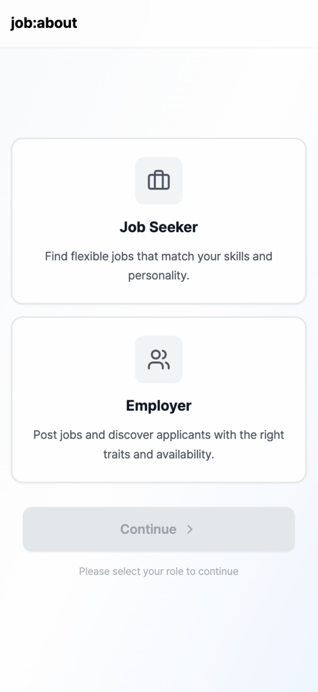
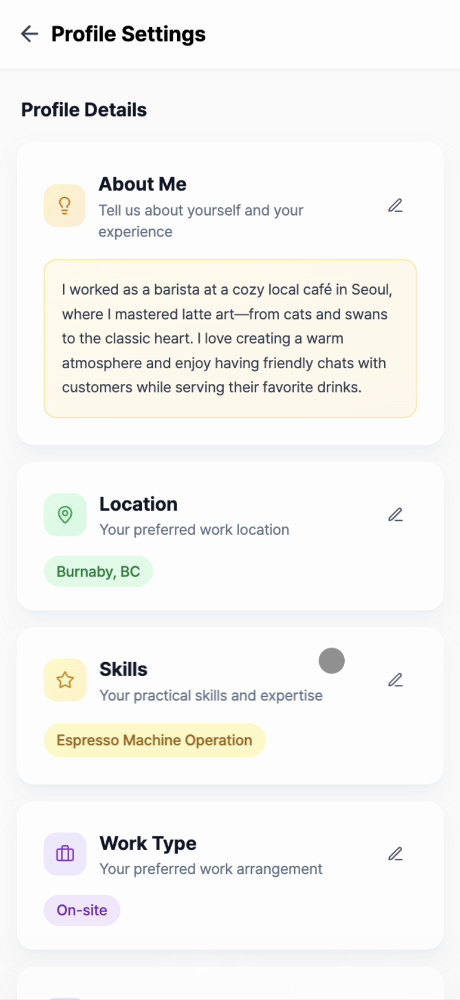

# 🇨🇦 job-about
**AI-powered job matching for Korean immigrants & local businesses in Canada**  
🔗 **[Try our service →](https://job-about.vercel.app/)**

---

## ✨ What is job-about?
Job-about connects job seekers and employers in Canada through **fun work-style quizzes**, smart recommendations, and AI-assisted job postings.  
We make hiring and applying fast, simple, and surprisingly enjoyable.

---

  
  

## 🙋🏻‍♀️ For Job Seekers

1. **Log in with Google and select “Create Job Seeker”** — quick, secure, and no password hassle.
   

     
   

2. **Take our story-based work-style quiz** — an interactive and engaging test that reveals your preferred way of working based on everyday situations.
   

     
     
   

3. **Create your profile** — highlight your skills and preferred job types.
   

     
     
   

4. **Browse your personalized job feed** — discover roles that match your profile. You can also use filters to further personalize your search.
   

     
     
   

5. **Apply in one click** — open the job post, view details, and apply instantly. You can also bookmark jobs for later — no tedious forms.
   

     
     
     
   

6. **Track your journey** — monitor all your applications and statuses in one dashboard.
   

     
     
     
     
   

---

## 🏢 For Employers
1. **Log in with Google** — instant access to your hiring dashboard.
   

     
   

2. **Create a business profile** — showcase your company’s personality and values.
   

     
     
   

   

3. **Post jobs with AI** — our AI helps you write engaging, clear job postings in seconds.
   

     
     
     
   

   🪄 Use Gemini API to generate job descriptions.
   

     
     
     

   

4. **Manage everything in one place** — from job listings to candidate pipelines.
    **Manage you job listings** — view, edit, and close your job posts.
   

     
     
     
     
     
   

   **Review applications** — see who applied, their profiles, and track their status.
   

     
     
     
   

---

## 🚀 Why job-about?
- **Fast & Easy** — no endless forms or complicated tools.
- **Smart Matching** — candidates meet jobs that *truly* fit them.
- **Bilingual-Friendly** — bridging Korean and English-speaking communities.
- **AI-Powered** — better job descriptions, smarter recommendations.

---
## 📚 Behind Our Project

### 🛠 Tech Stack
- **Frontend:** Next.js, React, TypeScript
- **Backend:** Next.js API Routes, Prisma ORM, PostgreSQL (Supabase)
- **Infrastructure:** Vercel, Sentry (logging & monitoring)
- **AI Services:** Gemini API for AI-assisted job posting

### 🗂 System Design (Overview)!
   

     
   

Job-about follows a **modern full-stack architecture**:
- **Client Layer** — Interactive UI built with Next.js and React.
- **API Layer** — Serverless API routes for job matching, authentication, and data access.
- **Database Layer** — PostgreSQL hosted on Supabase, accessed via Prisma ORM.
- **Integration Layer** — AI services (Gemini API) for generating job descriptions.
